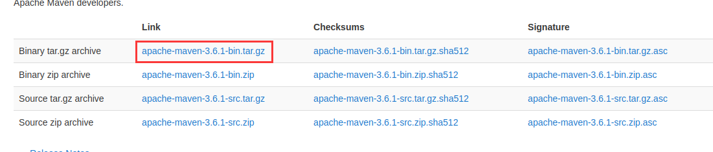
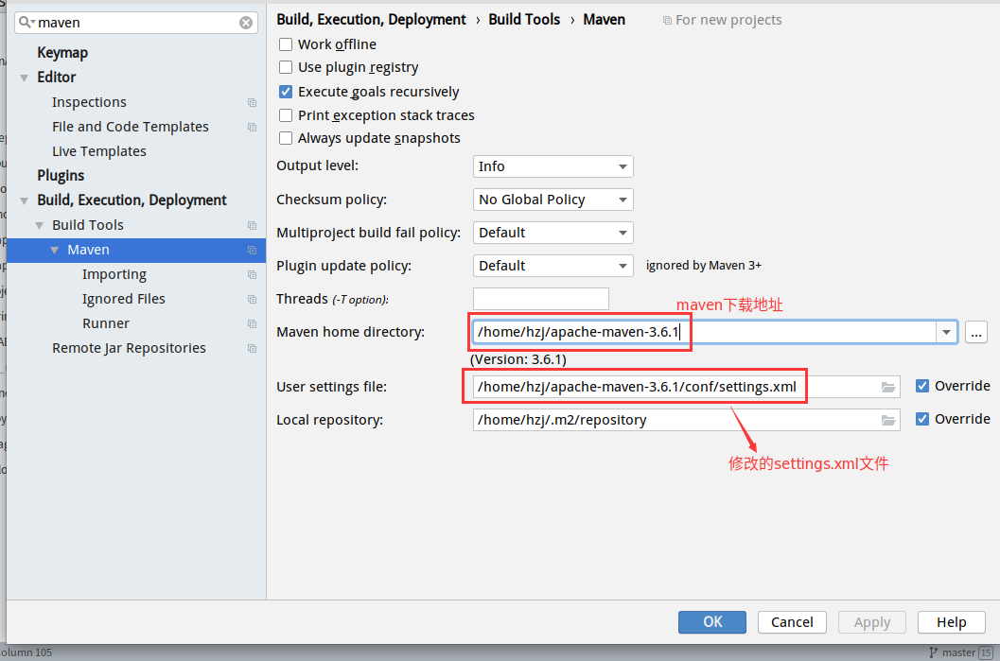

# Maven

## 安装(Linux)

1. 下载maven压缩包[https://maven.apache.org/download.cgi](https://maven.apache.org/download.cgi)



2. 在解压到`/home/hzj`文件夹下

3. 配置环境变量

```sh
export MAVEN_HOME=/home/hzj/apache-maven-3.6.1
export PATH=${PATH}:${MAVEN_HOME}/bin
```

4. 更新配置信息

```sh
source ~/.bashrc
```

5. 查看mvn的版本信息

```sh
mvn -v
```

6. 修改`apache-maven-3.6.1/conf`下的`settings.xml`文件内容

```xml
<!-- 配置阿里云镜像，原生的镜像速度 -->
  <mirrors>
    <!-- mirror
     | Specifies a repository mirror site to use instead of a given repository. The repository that
     | this mirror serves has an ID that matches the mirrorOf element of this mirror. IDs are used
     | for inheritance and direct lookup purposes, and must be unique across the set of mirrors.
     |
    <mirror>
      <id>mirrorId</id>
      <mirrorOf>repositoryId</mirrorOf>
      <name>Human Readable Name for this Mirror.</name>
      <url>http://my.repository.com/repo/path</url>
    </mirror>
     -->
     <mirror>
      <id>alimaven</id>
      <name>aliyun maven</name>
      <url>http://maven.aliyun.com/nexus/content/groups/public/</url>
      <mirrorOf>central</mirrorOf>
    </mirror>
  </mirrors>


<!-- 配置java的版本，因为默认的版本比较低 -->
  <profiles>
    <!-- profile
     | Specifies a set of introductions to the build process, to be activated using one or more of the
     | mechanisms described above. For inheritance purposes, and to activate profiles via <activatedProfiles/>
     | or the command line, profiles have to have an ID that is unique.
     |
     | An encouraged best practice for profile identification is to use a consistent naming convention
     | for profiles, such as 'env-dev', 'env-test', 'env-production', 'user-jdcasey', 'user-brett', etc.
     | This will make it more intuitive to understand what the set of introduced profiles is attempting
     | to accomplish, particularly when you only have a list of profile id's for debug.
     |
     | This profile example uses the JDK version to trigger activation, and provides a JDK-specific repo.
    <profile>
      <id>jdk-1.4</id>

      <activation>
        <jdk>1.4</jdk>
      </activation>

      <repositories>
        <repository>
          <id>jdk14</id>
          <name>Repository for JDK 1.4 builds</name>
          <url>http://www.myhost.com/maven/jdk14</url>
          <layout>default</layout>
          <snapshotPolicy>always</snapshotPolicy>
        </repository>
      </repositories>
    </profile>
    -->
    <profile>
      <id>jdk1.8</id>
      <activation>
        <activeByDefault>true</activeByDefault>
        <jdk>1.8</jdk>
      </activation>
      <properties>
        <maven.compiler.source>1.8</maven.compiler.source>
        <maven.compiler.target>1.8</maven.compiler.target>
        <maven.compiler.compilerVersion>1.8</maven.compiler.compilerVersion>
      </properties>
    </profile> 

    <!--
     | Here is another profile, activated by the system property 'target-env' with a value of 'dev',
     | which provides a specific path to the Tomcat instance. To use this, your plugin configuration
     | might hypothetically look like:
     |
     | ...
     | <plugin>
     |   <groupId>org.myco.myplugins</groupId>
     |   <artifactId>myplugin</artifactId>
     |
     |   <configuration>
     |     <tomcatLocation>${tomcatPath}</tomcatLocation>
     |   </configuration>
     | </plugin>
     | ...
     |
     | NOTE: If you just wanted to inject this configuration whenever someone set 'target-env' to
     |       anything, you could just leave off the <value/> inside the activation-property.
     |
    <profile>
      <id>env-dev</id>

      <activation>
        <property>
          <name>target-env</name>
          <value>dev</value>
        </property>
      </activation>

      <properties>
        <tomcatPath>/path/to/tomcat/instance</tomcatPath>
      </properties>
    </profile>
    -->
  </profiles>
```

## mvn命令

### clean

清除编译好的`.class`文件下的内容，也就是会删除`target`文件夹及其`target`里面的所有文件夹的内容

```sh
mvn clean
```

### compile

将项目进行编译，会在`src`的同级目录生成`target`文件夹，里面会有相应的内容

```sh
mvn compile
```

### test

将项目编写的测试类运行一遍，只会运行`xxxTest.java`文件下的测试

```sh
mvn test
```

### package

将项目进行打包编译

```sh
mvn package
```

### install

将项目打包到本地仓库

```sh
mvn install
```

### 项目运行

```
mvn xxx:run

# 例如一个web项目
mvn tomcat:run
```


### debug运行

```sh
mvnDebug xxx:run

# 例如一个web项目
mvnDebug tomcat:run
```

## 在idea配置

其实在idea根本不需要进行配置，就可以直接使用，因为idea内置有maven，也可以使用自己本地安装好的，为了使之前配置的阿里云镜像生效和java版本生效，需要配置下`User settings file`



## 项目拆分

项目拆分案例详情：[https://hzjanger.github.io/pinyougou/createProject/](https://hzjanger.github.io/pinyougou/createProject/)

### 文件主体目录

```
pinyougouparent/
├── pinyougou-dao
│   ├── pom.xml
│   └── src
│       ├── main
│       │   ├── java
│       │   └── resources
│       └── test
│           └── java
├── pinyougou-manager-web
│   ├── pom.xml
│   └── src
│       ├── main
│       │   ├── java
│       │   ├── resources
│       │   └── webapp
│       └── test
│           └── java
├── pinyougou-pojo
│   ├── pom.xml
│   └── src
│       ├── main
│       │   ├── java
│       │   └── resources
│       └── test
│           └── java
├── pinyougou-sellergoods-interface
│   ├── pom.xml
│   └── src
│       ├── main
│       │   ├── java
│       │   └── resources
│       └── test
│           └── java
├── pinyougou-sellergoods-service
│   ├── pom.xml
│   └── src
│       ├── main
│       │   ├── java
│       │   ├── resources
│       │   └── webapp
│       └── test
│           └── java
├── pom.xml
└── src
    ├── main
    │   ├── java
    │   └── resources
    └── test
        └── java

```


1. 建立一个父工程`pinyougouparent`，打包方式为`pom`

```xml
<?xml version="1.0" encoding="UTF-8"?>
<project xmlns="http://maven.apache.org/POM/4.0.0"
         xmlns:xsi="http://www.w3.org/2001/XMLSchema-instance"
         xsi:schemaLocation="http://maven.apache.org/POM/4.0.0 http://maven.apache.org/xsd/maven-4.0.0.xsd">
    <modelVersion>4.0.0</modelVersion>

    <groupId>com.pinyougou</groupId>
    <artifactId>pinyougou-parent</artifactId>
    <packaging>pom</packaging>
    <version>1.0-SNAPSHOT</version>
</project>
```

2. 在父工程下建立一个`pinyougou-pojo`的子模块，

```xml
<?xml version="1.0" encoding="UTF-8"?>
<project xmlns="http://maven.apache.org/POM/4.0.0"
         xmlns:xsi="http://www.w3.org/2001/XMLSchema-instance"
         xsi:schemaLocation="http://maven.apache.org/POM/4.0.0 http://maven.apache.org/xsd/maven-4.0.0.xsd">
    <parent>
        <artifactId>pinyougou-parent</artifactId>
        <groupId>com.pinyougou</groupId>
        <version>1.0-SNAPSHOT</version>
    </parent>
    <modelVersion>4.0.0</modelVersion>

    <artifactId>pinyougou-pojo</artifactId>


</project>
```

3. 在父工程下面建立一个`pinyougou-dao`的子模块,该子模块依赖与`pinyougou-pojo`模块

```xml
<?xml version="1.0" encoding="UTF-8"?>
<project xmlns="http://maven.apache.org/POM/4.0.0"
         xmlns:xsi="http://www.w3.org/2001/XMLSchema-instance"
         xsi:schemaLocation="http://maven.apache.org/POM/4.0.0 http://maven.apache.org/xsd/maven-4.0.0.xsd">
    <parent>
        <artifactId>pinyougou-parent</artifactId>
        <groupId>com.pinyougou</groupId>
        <version>1.0-SNAPSHOT</version>
    </parent>
    <modelVersion>4.0.0</modelVersion>

    <artifactId>pinyougou-dao</artifactId>

    <dependencies>
        <!-- 依赖pinyougou-pojo模块 -->
        <dependency>
            <groupId>com.pinyougou</groupId>
            <artifactId>pinyougou-pojo</artifactId>
            <version>1.0-SNAPSHOT</version>
        </dependency>
    </dependencies>

</project>
```

4. 在父工程下建立一个`pinyougou-sellergoods-interface`的子模块,该子模块也依赖于`pinyougou-pojo`模块

```xml
<?xml version="1.0" encoding="UTF-8"?>
<project xmlns="http://maven.apache.org/POM/4.0.0"
         xmlns:xsi="http://www.w3.org/2001/XMLSchema-instance"
         xsi:schemaLocation="http://maven.apache.org/POM/4.0.0 http://maven.apache.org/xsd/maven-4.0.0.xsd">
    <parent>
        <artifactId>pinyougou-parent</artifactId>
        <groupId>com.pinyougou</groupId>
        <version>1.0-SNAPSHOT</version>
    </parent>
    <modelVersion>4.0.0</modelVersion>

    <artifactId>pinyougou-sellergoods-interface</artifactId>

    <dependencies>
        <!-- 依赖pinyougou-pojo模块 -->
        <dependency>
            <groupId>com.pinyougou</groupId>
            <artifactId>pinyougou-pojo</artifactId>
            <version>1.0-SNAPSHOT</version>
        </dependency>
    </dependencies>


</project>
```

5. 在父工程下建立一个`pinyougou-sellergoods-service`的子模块，该模块是对`pinyougou-sellergoods-interface`中的接口的实现，依赖`pinyougou-sellergoods-interface`和`pinyougou-dao`模块

```xml
<?xml version="1.0" encoding="UTF-8"?>
<project xmlns="http://maven.apache.org/POM/4.0.0"
         xmlns:xsi="http://www.w3.org/2001/XMLSchema-instance"
         xsi:schemaLocation="http://maven.apache.org/POM/4.0.0 http://maven.apache.org/xsd/maven-4.0.0.xsd">
    <parent>
        <artifactId>pinyougou-parent</artifactId>
        <groupId>com.pinyougou</groupId>
        <version>1.0-SNAPSHOT</version>
    </parent>
    <modelVersion>4.0.0</modelVersion>

    <artifactId>pinyougou-sellergoods-service</artifactId>
    <!--打包类型-->
    <packaging>war</packaging>

    <dependencies>
        <!-- 依赖pinyougou-sellergoods-interface -->
        <dependency>
            <groupId>com.pinyougou</groupId>
            <artifactId>pinyougou-sellergoods-interface</artifactId>
            <version>1.0-SNAPSHOT</version>
        </dependency>
        <!-- 依赖inyougou-dao -->
        <dependency>
            <groupId>com.pinyougou</groupId>
            <artifactId>pinyougou-dao</artifactId>
            <version>1.0-SNAPSHOT</version>
        </dependency>
    </dependencies>
</project>
```

6. 在父工程下建立`pinyougou-manager-web`的子模块，该模块依赖`pinyougou-sellergoods-interface`模块

```xml
<?xml version="1.0" encoding="UTF-8"?>
<project xmlns="http://maven.apache.org/POM/4.0.0"
         xmlns:xsi="http://www.w3.org/2001/XMLSchema-instance"
         xsi:schemaLocation="http://maven.apache.org/POM/4.0.0 http://maven.apache.org/xsd/maven-4.0.0.xsd">
    <parent>
        <artifactId>pinyougou-parent</artifactId>
        <groupId>com.pinyougou</groupId>
        <version>1.0-SNAPSHOT</version>
    </parent>
    <modelVersion>4.0.0</modelVersion>
    <packaging>war</packaging>

    <artifactId>pinyougou-manager-web</artifactId>

    <dependencies>
        <!-- 依赖pinyougou-sellergoods-interface模块 -->
        <dependency>
            <groupId>com.pinyougou</groupId>
            <artifactId>pinyougou-sellergoods-interface</artifactId>
            <version>1.0-SNAPSHOT</version>
        </dependency>
    </dependencies>
</project>
```

最终项目就建立好了，其实总的来说不难发现这里的模块就是把一个项目中的一些包拆分成了一个一个的模块，在一个项目中的目录结构有可能是这样子的

```
src/
├── main
│   ├── java
│   │   └── com
│   │       └── hzj
│   │           ├── controller
│   │           ├── dao
│   │           ├── pojo
│   │           └── service
│   │               └── impl
│   └── resources
└── test
    └── java

```

虽然是把一些包拆分成一个一个的模块，但是在实际的开发过程中，如果采用分布式框架的话，也是非常有意义的